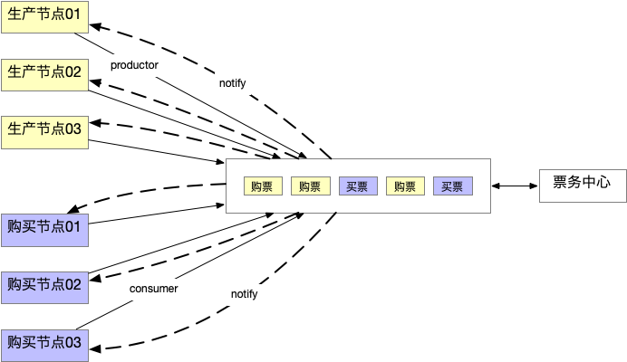

# golang concurrency 


result
```
➜  go run main.go
======concurrency sync mutex
id: 4  ticket: 9
id: 4  ticket: 8
id: 4  ticket: 7
id: 1  ticket: 6
id: 2  ticket: 5
id: 3  ticket: 4
id: 0  ticket: 3
id: 4  ticket: 2
id: 1  ticket: 1
id: 2  ticket: 0
0 done
======concurrency no lock
生成3张票，卖出2张，至少剩余一张
Pusher: 0  生成票: 0  成功
Pusher: 1  生成票: 1  成功
Pusher: 2  生成票: 2  成功
Poper: 0  购票: {0 1}  成功
Poper: 1  购票: {1 1}  成功
剩余: 1  票: [{2 1}]
生成2张票，卖出3张，至少卖出失败一张
Poper: 2  购票: 失败
Pusher: 0  生成票: 0  成功
Poper: 0  购票: 失败
Poper: 1  购票: {0 1}  成功
Pusher: 1  生成票: 1  成功
剩余: 1  票: [{1 1}]
```

select timeout
```
errChan := make(chan error)

	go func() {
		defer func() {
			errChan <- err
		}()
		r, err := http.Get(g.Url)
		if err != nil {
			return
		}
		defer r.Body.Close()
		w, err = net.ResponseRecorder(r)
	}()

	select {
	case err = <-errChan:
	case <-time.After(time.Duration(g.Timeout) * time.Second):
		return nil, ERR_REQUEST_TIMEOUT
	}

```
> 将业务逻辑放入goroutine中执行, 通过select 接收channel结果, 当timeout后， select 相应的case 直接返回;

sync mutex  concurrency 
```
	for total_tickets > 0 {

		mutex.Lock()
		// 如果有票就卖
		if total_tickets > 0 {
			time.Sleep(time.Duration(rand.Intn(5)) * time.Millisecond)
			// 卖一张票
			total_tickets--
			fmt.Println("id:", i, " ticket:", total_tickets)
		}
		mutex.Unlock()
	}
```
> 利用全局的sync.Mutex 对零界变量total_tickets 进行锁操作, 使并发下的total_tickets 变成串行操作，保证数据操作的准确性;

no lock concurrency 
```
// 全局读写共用管道, 使得读写串行
var pipe chan payload

// 初始化 读写共用管道 buffer 10; 
// 准备 ticketer() 接收读写
func init() {
	pipe = make(chan payload, 10)
	go ticketer()
}

// 生成者, 生成者由生成数据payload.in, 和接收回执管道payload.out 两部分组成;
func Push(i int) {
	// 生成接收者
	notify := make(chan interface{})
	// 生成票
	pipe <- payload{in: ticket{id: i, opt: 1}, out: notify}
	// 结果接收者
	n := <-notify
}

// 消费者, 由数据操作payload.in, 和接收回执管道的payload.out 两部分组成；
func Pop(i int) {
	// 生成接收者
	notify := make(chan interface{})

	//购买票
	pipe <- payload{in: ticket{id: i, opt: 2}, out: notify}

	//结果接收者
	n := <-notify
}

// 读写操作统一串行化
func ticketer() {
	for {
		select {
		case pl := <-pipe:
			if pl.in.opt == 1 { // 生成票
			// 写逻辑
			} else if pl.in.opt == 2 { // 购票
			//读逻辑
			}
		}
	}
}
```

模型



